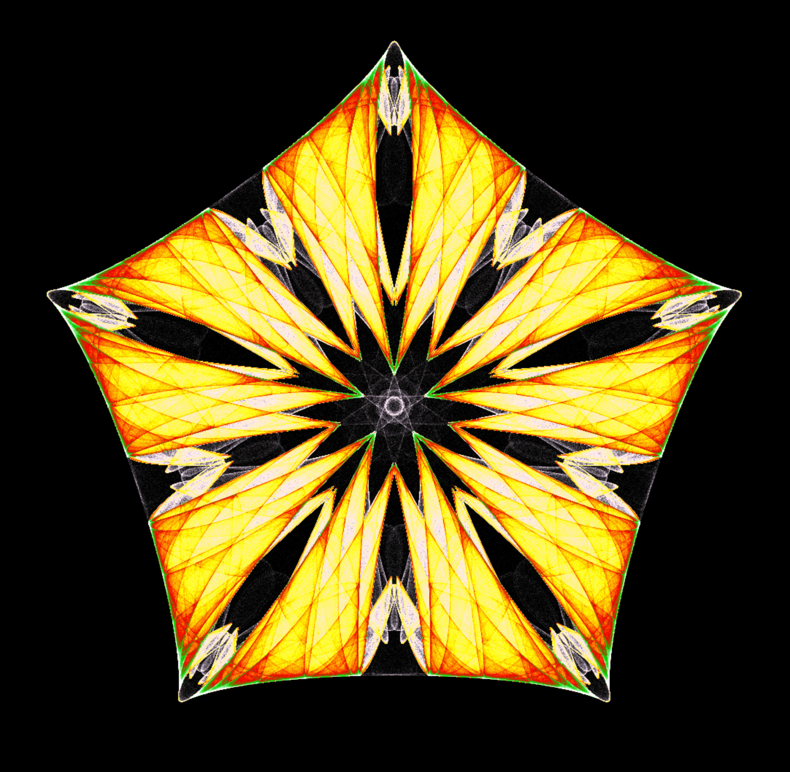

# Symmetry in Chaos

This repository contains code and parameters for rendering
the images published in the book "Symmetry in Chaos" (1st edition)
by Michael Field and Martin Golubitsky.



An webpage utilizing WebAssembly for rendering in the browser can be found on the github
page <https://sophonet.github.io/symmetryinchaos/>.

### Theory

In their book, Field and Golubitsky summarize mathematical properties of symmetry
as well as fundamentals of the chaotic behavior of non-linear systems like strange
attractors. They then introduce functions that by design falls into the category of
logistic maps while on the other hand has built-in properties of symmetry. This
function yield symmetric chaotic pointsets that are colored by their number of hits
during iteration. Their book includes more details about both symmetry as well as
chaos that can be found in nature.

### Prerequisites

The code uses the following external software packages:

* SDL for fast rendering <https://www.libsdl.org/>
* nlohmann/json for json parsing <https://github.com/nlohmann/json>
* jarro2783/cxxopts for command line parameters when building the native version <https://github.com/jarro2783/cxxopts>

### Installation

The single cpp source file can easily be compiled to a runtime executable, which is why build systems like CMake are not necessary:

```
g++ -o symmetryinchaos -std=c++14 -lSDL symmetryinchaos.cpp

```

The WebAssembly for running the code in a website can be built using the [Emscripten](https://emscripten.org/) compiler, e.g. using docker with

```
docker run \
  --rm \
  -v $(pwd):/src \
  -u $(id -u):$(id -g) \
  emscripten/emsdk \
  emcc symmetryinchaos.cpp -o index.js
```

### Dataset file

The [dataset.json](dataset.json) file contains parameters for all datasets that are described in the first edition of the book. Color maps have been inspired by another software package <https://symmetrichaos.sourceforge.net/> which is now unmaintained.

### Possible future extensions

While the software is intended to have minimal dependencies and code size, the index.html file could be extended such that individual parameters for the images can be adjusted "live" with range controls, allowing the discovery of new patterns or patterns that are similar to the datasets of the book.
